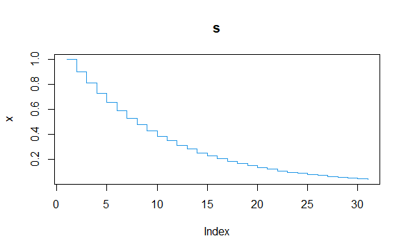
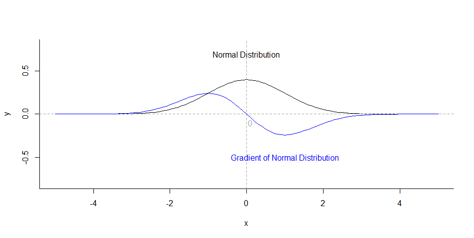
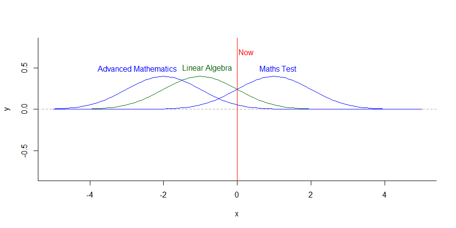

# 智能文档推荐算法

印张悦 ECNU 10174503110

母项目是一个文档日程管理的APP，本项目作为母项目的一部分，为解决用户面对大量文档时经常手忙脚乱，为找寻自己的目标文档耗费大量时间这一问题，设计一个智能化的文档推荐算法。

## 问题背景

如今数据隐私愈来愈成为人们关注的热点，文档日程管理的隐私性尤为重要，传统的推荐系统使用协同过滤算法计算用户之间的相似度，通过与其相似的用户的行为进行推荐，在文档推荐中这显然是不适用的，数据隐私要求我们不能将他人的文档推荐给陌生人，但在某些特殊情况下我们可以这么做，文末我们会提到。如果仅能使用单用户的历史数据，这就演变成一个通过用户历史数据对文档重要性进行排序的问题，我们使用word、ppt经常能看到最近打开的文档，即是**将用户打开的文档按历史记录的先后进行排序**，这仅仅考虑到时间的先后，而没有考虑到频次和用户日程等因素，无法得到较好的用户体验。

## 问题提出

为解决上述传统文档排序算法存在的问题，我们打算通过时间的先后、打开的频次、打开的时间长短等信息，制定一个智能化的推荐算法，同时我们算法是动态的，会针对用户的行为不断调整。

问题表述如下：已知用户打开文档的历史记录和日程信息，预测当前用户最需要打开的文档。

**目标：用户的目标文档应尽可能位于首位。**

## 概率预测模型

已知用户打开文档的历史记录，我们可以得到一个概率分布，记用户$A$有$a_1,a_2,\dots,a_n$，总计$n$个文档，文档$a_i$总共被打开了$t_i$次，该用户总共打开文档的次数为$t=\Sigma_{i=1}^nt_i$，则估计文档$a_i$下一次被打开的概率$p_i=\frac{t_i}{t}$，我们假定用户下一次打开文档这一行为服从这一概率分布，将文档按概率从高到低进行排序。

- 优点：简单、容易实现。

- 缺点：仅仅按频次高低排序，没有考虑时序的重要性，认为过去的和现在一样的重要，这显然是不切合实际的，若用户在一年月前为应对托福考试而反复浏览的“托福试题集”这一文档，现在已经考完许久了，还将其放在前列，这显然大大降低了用户体验。

## 时间窗口模型

为解决概率预测模型存在的问题，我们提出时间窗口模型，框定时间范围为一个月，在一个月内应用概率预测模型。

- 优点：简单，方便计算。

- 缺点：尽管只关注近一个月内打开的文档，但也存在概率预测模型的问题，加入用户三周前为准备会议反复修改ppt，会后就不再有如此大的需求，应将其重要性降低。

## 时间衰减模型 

为解决时间窗口模型存在的问题，我们提出时间衰减模型，利用指数衰减的方法，设定衰减因子为0.9，每过一天$t_i'=t_i\times0.9$，假定$t_i=1$，30天中没有再次打开该文档，则30天后$t'=0.04$，这个衰减趋势如下图所示：

可以看到这个衰减趋势非常理想，可以大大降低过去文档的重要程度，文档的打开时间距离现在时间间隔越长，文档的重要性越低，这非常切合实际。

- 优点：添加了时序的概念，相隔时间越久，重要性越低。
- 缺点：时间复杂度很高，是累乘运算，计算所有的历史记录非常消耗算力。

## 窗口式时间衰减模型

显然我们没有必要对过去所有的历史记录应用时间衰减模型，这相当消耗算力，时间间隔较长的文档$t'_i$会趋近于$0$，之前我们已经提到30天后$t'=0.04$，显然30天前打开过的文档对现在的影响微乎其微，因此我们不妨将时间窗口模型和时间衰减模型结合起来，仅在30天内应用时间衰减模型。

- 优点：大大降低了计算量。

## 平滑的窗口式时间衰减模型

尽管窗口式时间衰减模型解决了我们之前提到的问题，但仍然存在一个缺陷，以天为单位指数递减太过粗粒度。我们使用应用经常是集中使用的，短时间内我们会打开多个文档，这些文档按照时间先后重要性也应该是不同的，因此我们需要一个平滑的窗口式时间衰减模型，将原本离散的函数连续化，我们尝试使用正态分布近似原本的函数。

.png)

我们将原本的函数和$\mu=0,\sigma^2=9$的正态分布绘制在一张图上（因为原本的函数累和不为1，因此不能称之为分布），正态分布的形态和原本的函数形态基本一致，因此我们先假定正态分布是原本函数一个较好的连续化方式，具体这能否成立关键看我们最后的模型的效果，此外正态分布还有许多不错的性质。

1. 既然是分布，概率和必然是归一化的。
2. 参数简单，仅包含$\mu$和$\sigma^2$两个参数，而且我们后面会提到$\mu$是由用户行为得到的，$\sigma^2$正是我们动态调整不同用户分布形态的重要参数。
3. 我们对标准正态分布求导，如下图蓝线所示，可以看到$x>0$部分梯度先减后增，意味着正态分布先缓慢下降，然后快速下降，最后再平缓下来，这是非常符合实际的。用户打开一个文档后，近一两天内用户可能会由于修改或者复习的需要再次打开该文档，该文档应保持较高的重要性，等再过个3~4天，该文档的“保质期”过了，重要性就应该快速下降，之后一直保持在一个较低的水平。（如果再次打开这个文档，这是另外一个事件，会建立一个新的分布，新的分布会大大提高这个文档的重要性）

4. 正态分布是左右对称的，这便于我们将日程引入其中，计算未来将会发生的事件对当前的影响。

## 最终模型的建立

根据上文的阐述，我们在平滑的窗口式时间衰减模型的基础上提出最终的模型方案。

将x轴作为时间轴，y轴表示概率，一旦用户在某一时刻打开了某个文档，则以该时刻为$\mu$，（$\sigma^2$的规则在算法细节处阐述）建立一个正态分布，假定一个月内该文档总共被打开了$m_i$次，之后用户在未来某一时刻打开$a_i$文档的概率$p_i=\Sigma_{j=1}^{m_i}p_{ij}$，其中$p_{ij}$为第$j$个分布在当前时刻的概率取值。然后将文档按概率值$p_i$从高到低进行排序。

之前我们提到要通过日程信息引入未来发生的事对当前的影响，由于正态分布的对称性使这个问题变得十分简单，以未来的某个时刻为$\mu$建立正态分布，通过关键字匹配等方式将日程关联到文档，假定匹配到了$k$个文档，那么就等价于新建了$k$个正态分布，但因为其对于当前的影响是一致的，因此我们仅需要计算1次而不是$k$次。我们设定考虑未来一个月的日程信息，通过该方法就将日程信息引入了文档排序之中。

下面让我们举一个实际的例子，为方便理解，设定x轴的时间刻度为天，当前时刻为0，假定用户A包含高等数学和线性代数2个文档，用户A两天前打开过高等数学，一天前打开过线性代数，明天恰好有数学考试，在这样的情境下，数学考试这一日程会被关联到高等数学这个文档，之后我们的算法分别计算线性代数（绿线分布）在当前时间的概率取值$p_1$以及高等数学（两条蓝线的分布）在当前时间的概率取值$p_2=p_{21}+p_{22}$，根据$p_1$和$p_2$的大小对两个文档进行排序。

## 算法细节

现在我们来关注一些算法上的细节。

### $\sigma^2$的调整规则

首先是$\sigma^2$的规则，之前我们提到$\sigma^2$是我们动态调整不同用户分布形态的重要参数，$\sigma^2$越小，分布越向$\mu$靠拢；$\sigma^2$越大，分布越分散。我们显然不想看到一个十分平坦的分布，因为这无法体现时间先后带来的差异性，因此$\sigma^2$不能太大，我们初始将其设定为9，能够较好的体现一个月内重要性的变化。但如果用户频繁的打开文档，比如用户一天要打开100个文档，由于打开文档过于频繁，每个文档重要性的“保质期”就应该缩短一点，这时我们就需要减小$\sigma^2$。

$\sigma^2$初试值为9，一旦用户在半月个（14天）内平均打开文档次数$v$超过50，对$\sigma^2$进行更新：$\sigma^2=9-\frac{v}{50}$，这个50是我们预估平均每位用户每天打开文档的次数，产品上线之后可以根据实际的使用情况进行调整。需要注意的是$\sigma^2$必须为非负数，因此还需要大于等于0的条件。这样我们就可以根据每位用户的行为动态的调整分布的形态，使其获得较好的体验。

### 进一步减小算法复杂度

尽管我们只关注前后一个月的范围，很大程度上减小了计算量，但如果在算力有限的情况下想要进一步减小算法复杂度，我们可以通过用空间换时间的方法，定期的计算一些结果存储起来，方便计算。

一般日程信息不会很多，因此不对未来一个月进行优化。而对过去一个月，每天结束时（23:59）计算过去30天的文档概率值，存储到数据库中，之后使用时在这个基础上$\times0.9$即可（实现中我们可以乘上0.9之后再存入数据库，进一步减小计算的复杂度）。这样只需要计算当天的和未来的日程信息即可，在原来的基础上进行增量式的计算大大降低了计算时的时间复杂度。

### 周期性功能

对于学生用户，每学期的课表是固定的，他们对于文档的使用会呈现以周为单位的周期性现象。对于这类会产生周期性现象的用户，我们需要对排序算法进行优化以适应他们的需求。

但实际实现中我们仅考虑以周为单位的周期性，而不考虑月、年，因为这个时间跨度太久了，将一个月前甚至一年前的文档排在前面会让用户觉得很奇怪，而且就算存在这样的周期性行为，企业也往往会发放新的文档，旧文档只有在极少数情况下会被翻找出来，给予旧文档很高的重要性是不切实际的。

首先要解决的就是如何判断用户行为存在周期性这个问题，可能是以7天为单位的，也可能仅仅在工作日存在周期性。我们分别对前两周和前两周的工作日计算Jaccard相似度，设上上周每天打开的文档集合分别为$R_1,R_2,,\dots,R_7$，上周每天打开的文档集合分别为$Q_1,Q_2,,\dots,Q_7$。
$$
Jacarrd_{seven \ day}=\frac{1}{7}\Sigma_{i=1}^7\frac{|R_i \cap Q_i|}{|R_i \cup Q_i|} \\
Jacarrd_{weekday}=\frac{1}{5}\Sigma_{i=5}^5\frac{|R_i \cap Q_i|}{|R_i \cup Q_i|}
$$
如果$Jacarrd_{seven \ day} \ge \frac{1}{2}$，则将上一周的分布平移到本周，这样即考虑到了本周打开文档的记录，也把周期性的概念引入，相当于加了一个周期性的先验。

如果$Jacarrd_{seven \ day}<\frac{1}{2}$但$Jacarrd_{weekday} \ge \frac{1}{2}$，则仅在工作日应该上述算法，在双休日不加上周期性的先验。

如果上述两项都不成立，则表明用户没有周期性的特征，不需要进行分布的平移。

## 未来的畅想

所有的算法的原理和实现上的细节已经阐述完毕，这里我们谈一谈未来的工作。

对于文本重要性的排序，我们已经引入了时序性、打开频次、未来日程的影响、用户周期性行为的影响，考虑的已经十分健全，但如果我们能再将用户对文档价值的预判加入其中，这能更好地完善我们的模型。

实际生活中你查找文档时经常觉得这个标题好像是，但无法确定内容是否是你想要的。这时你会打开看一看这个文档，如果是你想要的，你会修改其中的内容或仔细加以阅读，但如果不是，你浏览一下之后会很快关掉这个文档。

针对用户的这一行为，我们可以对该文档是否是用户的目标文档进行分类，如果是，应用我们上述的算法毫无问题；但如果不是，我们完全没必要将这个文档等同于目标文档看待，甚至应该大大降低这个文档的重要性，因为这个文档不是用户想要的。

这是一个分类问题，但实现上需要大量的用户行为数据，我们不能简单的通过时间长短进行衡量，或许我们可以说这是一个大文件但用户仅仅浏览了很短一段时间，肯定不是用户的目标文档，但这不好说，可能这就是用户的目标文档，只是打开确定一下。

这一功能的实现会是我们的算法更加强大，但在产品上线前这只是一个想法，需要产品上线后大量的用户行为数据进行模型的训练，期待未来的实现。

## 应用设计

我们给予用户充分的选择空间，在应用设计时用户可以选择按智能算法排序还是按时间排序，用户也可以手动标记自己是哪类周期性用户，方便我们更好的对文档进行排序。

## 用户群的概念

之前我们提到过在某种情况下可以使用传统推荐系统的协同过滤算法，就是建立了用户群，这里的文档是群内用户共享的，比如一个小的团队，或者班级等。如果用户A和用户B在同一群下，而且恰好发现用户A的行为和用户B的行为十分相似，那么就可以根据用户B的行为对用户A进行相关的推荐，传统的推荐算法也就有了用武之地。这里排序和推荐的结果应用中我们分别放置在两个窗口，不建立算法间的联系。（协同过滤的结果以弹窗的方式体现）

## 写在最后

标题是文档推荐，其实讲述的是一个排序算法，原因开篇已经写明，如有造成困惑请见谅。其实排序也是推荐系统的一个重要组成部分，排序的先后代表了我们推荐程度的高低。本文Code均采用python实现，主要接口写在README.md中（更详细的内容建议参阅代码），十分感谢你能读到这里，希望本文能对你有所帮助！

