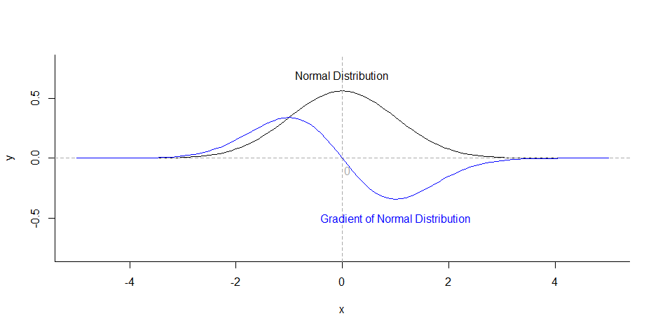

# 智能文档推荐算法

印张悦 10174503110

母项目是一个文档日程管理的APP，本项目作为母项目的一部分，为解决用户面对大量文档时经常手忙脚乱，为找寻自己的目标文档耗费大量时间这一问题，设计一个智能化的文档推荐系统算法。

## 问题背景

如今数据隐私愈来愈成为人们关注的热点，文档日程管理的隐私性尤为重要，传统的推荐系统使用协同过滤算法计算用户之间的相似度，通过与其相似的用户的行为进行推荐，在文档推荐中这显然是不适用的，数据隐私要求我们不能将他人的文档推荐给陌生人，但在某些特殊情况下我们可以这么做，之后我们会提到。如果仅能使用单用户的历史数据，这就演变成一个通过用户历史数据对文档重要性进行排序的问题，我们使用word、ppt经常能看到最近打开的文档，即是**将用户打开的文档按历史记录的先后进行排序**，这仅仅考虑到时间的先后，而没有考虑到频次和用户日程等因素，无法得到较好的用户体验。

## 问题提出

为解决上述传统文档排序算法存在的问题，我们打算通过时间的先后、打开的频次、打开的时间长短等信息，制定一个智能化的推荐算法，同时我们算法是动态的，会针对用户的行为不断调整。

问题表述如下：已知用户打开文档的历史记录和日程信息，预测当前用户最需要打开的文档。

**目标：用户的目标文档应尽可能位于首位。**

## 概率预测模型

已知用户打开文档的历史记录，我们可以得到一个概率分布，记用户$A$有$a_1,a_2,\dots,a_n$，总计$n$个文档，文档$a_i$总共被打开了$t_i$次，该用户总共打开文档的次数为$t=\Sigma_{i=1}^nt_i$，则估计文档$a_i$下一次被打开的概率$p_i=\frac{t_i}{t}$，我们假定用户下一次打开文档这一行为服从这一概率分布，将文档按概率从高到低进行排序。

- 优点：简单、容易实现。

- 缺点：仅仅按频次高低排序，没有考虑时序的重要性，认为过去的和现在一样的重要，这显然是不切合实际的，若用户在一年月前为应对托福考试而反复浏览的“托福试题集”这一文档，现在已经考完许久了，还将其放在前列，这显然大大降低了用户体验。

## 时间窗口模型

为解决概率预测模型存在的问题，我们提出时间窗口模型，框定时间范围为一个月，在一个月内应用概率预测模型。

- 优点：简单，方便计算。

- 缺点：尽管只关注近一个月内打开的文档，但也存在概率预测模型的问题，加入用户三周前为准备会议反复修改ppt，会后就不再有如此大的需求，应将其重要性降低。

## 时间衰减模型 

为解决时间窗口模型存在的问题，我们提出时间衰减模型，利用指数衰减的方法，设定衰减因子为0.9，每过一天$t_i'=t_i\times0.9$，假定$t_i=1$，30天中没有再次打开该文档，则30天后$t'=0.04$，这个衰减趋势如下图所示：

可以看到这个衰减趋势非常理想，可以大大降低过去文档的重要程度，文档的打开时间距离现在时间间隔越长，文档的重要性越低，这非常切合实际。

- 优点：添加了时序的概念，相隔时间越久，重要性越低。
- 缺点：计算量非常复杂，是累乘运算，计算所有的历史记录非常消耗算力。

## 窗口式时间衰减模型

显然我们没有必要对过去所有的历史记录应用时间衰减模型，这相当消耗算力，时间间隔较长的文档$t'_i$会趋近于$0$，之前我们已经提到30天后$t'=0.04$，因此我们不妨将时间窗口模型和时间衰减模型结合起来，仅在30天内应用时间衰减模型。

- 优点：大大降低了计算量。

## 平滑的窗口式时间衰减模型

尽管窗口式时间衰减模型解决了我们之前提到的问题，但仍然存在一个缺陷，以天为单位指数递减太过粗粒度。我们使用应用经常是集中使用的，短时间内我们会打开多个文档，这些文档按照时间先后重要性也应该是不同的，因此我们需要一个平滑的窗口式时间衰减模型，将原本离散的函数连续化，我们尝试使用正态分布近似原本的函数。

.png)

我们将原本的函数和$\mu=0,\sigma=9$的正态分布绘制在一张图上（因为原本的函数累和不为1，因此不能称之为分布），正态分布的形态和原本的函数形态基本一致，因此我们先假定正态分布是原本函数一个较好的连续化方式，具体这能否成立关键看我们最后的模型的效果，此外正态分布还有许多不错的性质。

1. 既然是分布，概率和必然是归一化的。
2. 参数简单，仅包含$\mu$和$\sigma^2$两个参数，而且我们后面会提到$\mu$是由用户行为得到的，$\sigma^2$正是我们动态调整不同用户分布形态的重要参数。
3. 我们对标准正态分布求导，如下图蓝线所示，可以看到$x>0$部分梯度先减后增，意味着正态分布先缓慢下降，然后快速下降，最后再平缓下来，这是非常符合实际的。用户打开一个文档后，近一两天内用户可能会由于修改或者复习的需要再次打开该文档，该文档应保持较高的重要性，等到再过个3~4天，该文档的“保质期”过了，重要性就应该快速下降，之后一直保持在一个较低的水平。（如果再次打开这个文档，这是另外一个事件，会建立一个新的分布，新的分布会大大提高这个文档的重要性）

## 最终模型的建立

根据上文的阐述，我们在平滑的窗口式时间衰减模型的基础上提出最终的模型方案。

将x轴作为时间轴，y轴表示概率，一旦用户在某一时刻打开了某个文档，则以该时刻为$\mu$，（$\sigma^2$基于如下规则）建立一个正态分布，之后用户在未来某一时刻打开$a_i$文档的概率，

